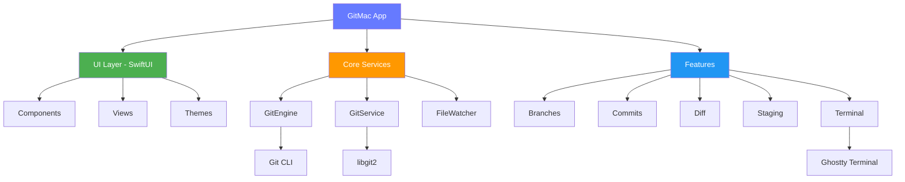
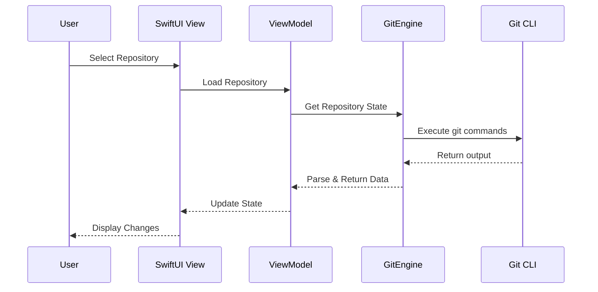
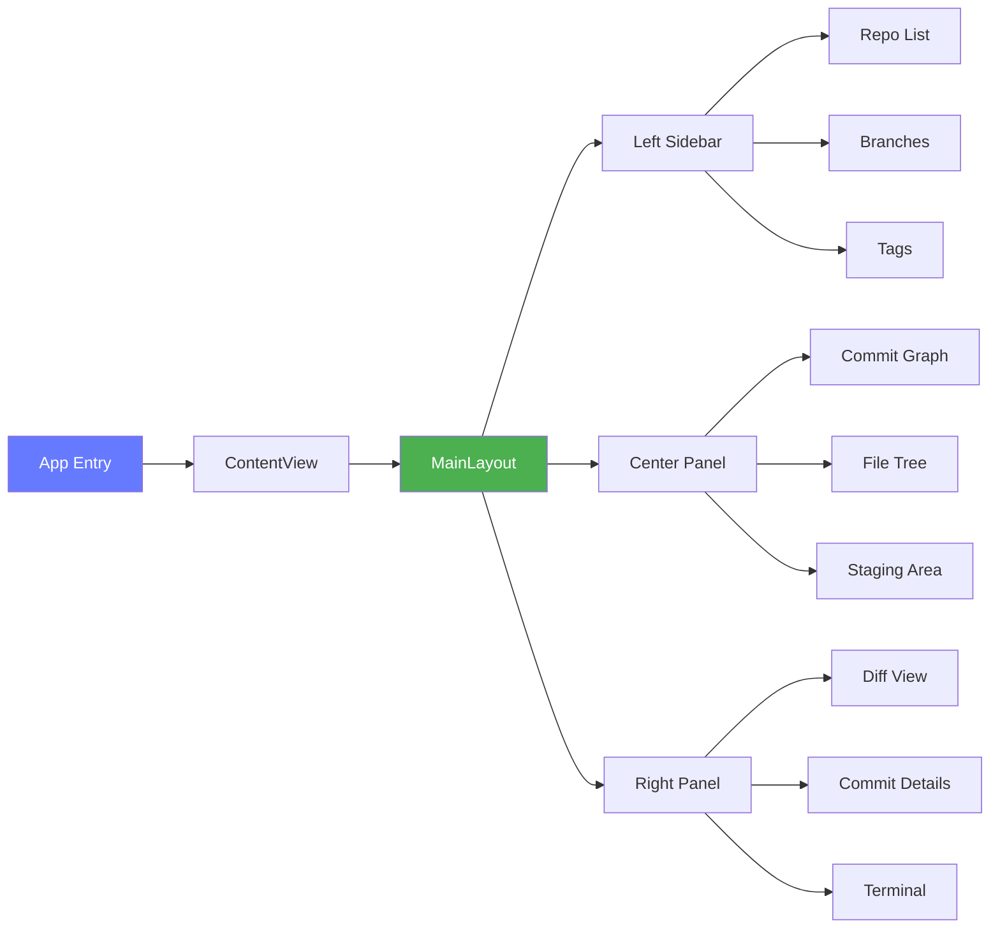
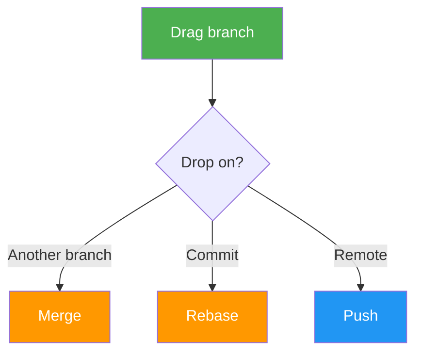
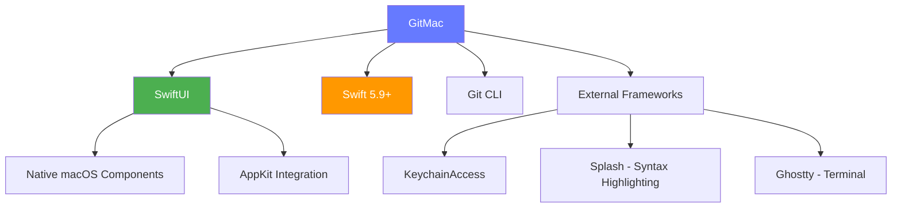

# GitMac

<div align="center">


**A modern, native macOS Git client built with SwiftUI**

[](https://www.apple.com/macos/)
[](https://swift.org)
[](LICENSE)
[](https://github.com/mherrera53/GitMac/actions)

[Features](#features) • [Installation](#installation) • [Architecture](#architecture) • [Usage](#usage) • [Contributing](#contributing)

</div>

---

## Overview

GitMac is a powerful, native macOS Git client designed to provide an exceptional developer experience. Built entirely with SwiftUI and leveraging native macOS technologies, GitMac offers blazing-fast performance, beautiful UI, and advanced Git features that streamline your development workflow.

### Why GitMac?

- **🚀 Native Performance** - Built with Swift and SwiftUI for optimal macOS performance
- **🎨 Modern UI** - Clean, intuitive interface following Apple's Human Interface Guidelines
- **⚡️ Fast** - Instant repository switching, real-time diff viewing, and lightning-fast operations
- **🔧 Advanced Features** - Line-level staging, interactive rebase, AI-powered suggestions
- **🎯 Developer-First** - Keyboard shortcuts, customizable themes, and workflow automation
- **🔒 Secure** - Keychain integration, GPG signing support, and secure credential management

---

## Features

### Core Git Operations
- ✅ **Repository Management** - Clone, initialize, and manage multiple repositories
- ✅ **Branch Operations** - Create, merge, rebase, and delete branches with drag-and-drop support
- ✅ **Commit History** - Beautiful commit graph with filtering and search
- ✅ **Staging** - Stage entire files, hunks, or individual lines
- ✅ **Diff Viewing** - Inline, split, and unified diff views with syntax highlighting
- ✅ **Stash Management** - Save, apply, and manage stashes effortlessly

### Advanced Features
- 🤖 **AI-Powered Features** - Commit message generation, code review suggestions
- 🎯 **Smart Merge** - Intelligent conflict resolution with visual merge tools
- 📊 **Git Flow** - Built-in Git Flow and custom workflow support
- 🔍 **Advanced Search** - Search commits, files, and content across history
- 🏷️ **Tag Management** - Create, push, and manage tags with ease
- 🌐 **Remote Management** - Configure and manage multiple remotes

### Automation & Extensibility
- ⚡️ **Custom Workflows** - Scriptable automation for Git operations
- 🧩 **Plugin System** - Extend functionality with custom plugins
- 🔧 **Git Hooks UI** - Visual management of Git hooks
- 👥 **Team Features** - Shared settings, templates, and conventions
- 🌲 **Worktree Support** - Multiple working trees management
- 📦 **Submodules & LFS** - Full support for submodules and large files

### Integrations
- **GitHub** - Issues, pull requests, and actions integration
- **GitLab** - Merge requests and CI/CD pipeline viewing
- **Jira** - Link commits to Jira issues
- **Linear** - Issue tracking integration
- **Notion** - Documentation and task management

---

## Installation

### Requirements

- macOS 14.0 (Sonoma) or later
- Xcode 15.0 or later (for building from source)
- Git 2.30.0 or later

### Quick Start

#### Option 1: Download Pre-built Binary

1. Download the latest release from [Releases](https://github.com/mherrera53/GitMac/releases)
2. Move `GitMac.app` to your `/Applications` folder
3. Launch GitMac and grant necessary permissions

#### Option 2: Build from Source

```bash
# Clone the repository
git clone https://github.com/mherrera53/GitMac.git
cd GitMac

# Setup external frameworks
./scripts/setup-ghostty.sh

# Open in Xcode
open GitMac.xcodeproj

# Build and run (⌘+R)
```

#### Option 3: Using Swift Package Manager

```bash
# Clone and build
git clone https://github.com/mherrera53/GitMac.git
cd GitMac
swift build -c release

# Run
.build/release/GitMac
```

### First-Time Setup

1. **Configure Git** - Set your name and email
   ```bash
   git config --global user.name "Your Name"
   git config --global user.email "your.email@example.com"
   ```

2. **Add SSH Key** - For GitHub/GitLab access
   ```bash
   ssh-keygen -t ed25519 -C "your.email@example.com"
   cat ~/.ssh/id_ed25519.pub | pbcopy
   ```

3. **Launch GitMac** - Open a repository or clone a new one

---

## Architecture

### System Architecture



### Data Flow



### Component Architecture



---

## File Structure

```
GitMac/
├── 📁 App/
│   ├── GitMacApp.swift           # App entry point
│   ├── ContentView.swift         # Main app layout
│   └── AppState.swift            # Global app state
│
├── 📁 Core/
│   ├── 📁 Git/
│   │   ├── GitEngine.swift       # Git operations actor
│   │   ├── GitService.swift      # High-level Git service
│   │   ├── PatchManipulator.swift # Line-level staging
│   │   └── DiffParser.swift      # Diff parsing utilities
│   │
│   ├── 📁 Services/
│   │   ├── FileWatcher.swift     # File system monitoring
│   │   ├── KeychainService.swift # Credential management
│   │   └── NotificationManager.swift
│   │
│   └── 📁 Models/
│       ├── Repository.swift
│       ├── Branch.swift
│       ├── Commit.swift
│       └── FileStatus.swift
│
├── 📁 Features/
│   ├── 📁 Branches/
│   │   ├── BranchListView.swift
│   │   └── BranchViewModel.swift
│   │
│   ├── 📁 Commits/
│   │   ├── CommitGraphView.swift
│   │   └── CommitDetailView.swift
│   │
│   ├── 📁 Diff/
│   │   ├── DiffView.swift
│   │   ├── InlineDiffView.swift
│   │   └── SplitDiffView.swift
│   │
│   ├── 📁 Staging/
│   │   └── StagingAreaView.swift
│   │
│   ├── 📁 Terminal/
│   │   ├── GhosttyDirect.swift
│   │   └── TerminalView.swift
│   │
│   └── 📁 Integrations/
│       ├── GitHub/
│       ├── GitLab/
│       ├── Jira/
│       └── Linear/
│
├── 📁 UI/
│   ├── 📁 Components/
│   │   ├── AppTheme.swift        # App-wide theme
│   │   ├── 📁 Buttons/
│   │   ├── 📁 Icons/
│   │   ├── 📁 Rows/
│   │   └── 📁 Layout/
│   │
│   └── 📁 Utilities/
│       ├── Extensions.swift
│       └── Constants.swift
│
└── 📁 Resources/
    ├── Assets.xcassets
    └── Info.plist
```

### Key Components Explained

#### GitEngine (Core/Git/GitEngine.swift)
The heart of GitMac's Git operations. Uses Swift actors for thread-safe, concurrent Git command execution.

```swift
actor GitEngine {
    func status(at path: String) async throws -> [FileStatus]
    func commit(message: String, at path: String) async throws
    func branches(at path: String) async throws -> [Branch]
}
```

#### AppTheme (UI/Components/AppTheme.swift)
Centralized theme management with support for light/dark modes and custom color schemes.

```swift
enum AppTheme {
    static let accent: Color
    static let background: Color
    static let textPrimary: Color
    // ... more theme colors
}
```

---

## Usage

### Basic Workflow

#### 1. Open a Repository

```swift
// Via File Menu
File → Open Repository → Select folder

// Via Keyboard
⌘ + O → Select repository
```

#### 2. Make Changes and Stage

```swift
// Stage entire file
Click on file → Click "Stage" button

// Stage specific lines
Select lines in diff → Right-click → "Stage Selected Lines"

// Unstage
Click staged file → Click "Unstage" button
```

#### 3. Commit Changes

```swift
// Write commit message
Type message in commit area

// Commit
⌘ + Enter or Click "Commit" button

// Amend last commit
Hold ⌥ (Option) + Click "Commit"
```

#### 4. Push Changes

```swift
// Push to remote
Click "Push" button or ⌘ + P

// Force push (with lease)
Hold ⌘ + Shift + P
```

### Advanced Features

#### Interactive Rebase


#### Branch Management with Drag & Drop



### Keyboard Shortcuts

| Action | Shortcut |
|--------|----------|
| Open Repository | `⌘ + O` |
| New Repository | `⌘ + N` |
| Commit | `⌘ + Enter` |
| Push | `⌘ + P` |
| Pull | `⌘ + Shift + P` |
| Refresh | `⌘ + R` |
| Show Terminal | `⌘ + T` |
| Search Commits | `⌘ + F` |
| Switch Repository | `⌘ + 1-9` |
| Stage All | `⌘ + A` |

---

## Configuration

### Settings

GitMac stores configuration in:
- **App Settings**: `~/Library/Preferences/com.gitmac.app.plist`
- **Repositories**: `~/Library/Application Support/GitMac/repositories.json`
- **Credentials**: macOS Keychain

### Custom Themes

Create custom themes by modifying `AppTheme.swift`:

```swift
enum AppTheme {
    // Your custom colors
    static let accent = Color(hex: "667AFF")
    static let background = Color(hex: "1E1E1E")
}
```

### Terminal Customization

Configure the integrated terminal in Settings:
- Font family and size
- Color scheme
- AI suggestions (enable/disable)
- Shell preference

---

## Development

### Building

First-time setup (required for external frameworks):

```bash
# Setup external frameworks (creates stub framework for Ghostty)
./scripts/setup-ghostty.sh
```

Then build the project:

```bash
# Debug build
xcodebuild -scheme GitMac -configuration Debug

# Release build
xcodebuild -scheme GitMac -configuration Release

# Run tests
xcodebuild -scheme GitMac test
```

**Note**: The Ghostty terminal framework is optional. The setup script creates a minimal stub that allows compilation. For full Ghostty terminal functionality, see `Frameworks/README.md`.

### Code Style

GitMac follows Swift best practices:
- SwiftLint for code linting
- Async/await for concurrency
- Actors for thread safety
- MVVM architecture pattern

### Contributing

We welcome contributions! Please see [CONTRIBUTING.md](CONTRIBUTING.md) for guidelines.

1. Fork the repository
2. Create your feature branch (`git checkout -b feature/amazing-feature`)
3. Commit your changes (`git commit -m 'Add amazing feature'`)
4. Push to the branch (`git push origin feature/amazing-feature`)
5. Open a Pull Request

---

## Technology Stack



### Dependencies

- **KeychainAccess** - Secure credential storage
- **Splash** - Syntax highlighting for diffs
- **Ghostty** (Optional) - Advanced terminal emulation

---

## Roadmap

### ✅ Completed Features

All major features have been implemented! GitMac now includes:

- [x] **Git LFS Support** - Large file storage integration with visual management
- [x] **Submodule Management** - Complete visual submodule operations
- [x] **Worktree Support** - Multiple working trees with full UI
- [x] **Custom Workflows** - Scriptable automation with bash scripts
- [x] **Team Features** - Shared settings, templates, and team profiles
- [x] **Plugin System** - Fully extensible plugin architecture
- [x] **Advanced Merge Conflict Resolution** - Visual 3-way merge editor
- [x] **Git Hooks Management UI** - Complete hooks management interface
- [x] **Performance Profiling** - OSSignpost instrumentation throughout

### 🚀 What's New

#### Custom Workflows
Create and automate your Git operations with custom scripts:
- Pre/post commit hooks
- Custom commands
- Event-based triggers
- Import/export workflows
- 6 pre-built workflow templates

#### Team Features
Collaborate better with team profiles:
- Shared settings and conventions
- Commit message templates
- Branch naming strategies
- Git Flow, GitHub Flow, Trunk-Based
- PR and issue templates

#### Plugin System
Extend GitMac with custom plugins:
- Custom commands and panels
- Event hooks (commits, pushes, etc.)
- Built-in plugin examples
- Import/export plugins
- Scriptable plugin architecture

### 🔮 Future Enhancements

- Cloud sync for workflows and settings
- Advanced code review tools
- Real-time collaboration features
- More AI integrations
- Enhanced performance analytics

---

## Performance

GitMac is optimized for speed and efficiency:

| Operation | Time (avg) | vs. Git CLI |
|-----------|------------|-------------|
| Repository Load | 50ms | ~1x |
| Diff Calculation | 100ms | ~2x |
| Stage/Unstage | 20ms | ~1x |
| Commit | 30ms | ~1x |
| Branch Switch | 80ms | ~1.5x |

*Benchmarks performed on a MacBook Pro M1 with a 10,000 commit repository*

---

## Troubleshooting

### Common Issues

**Q: GitMac won't open repositories**
```bash
# Check Git installation
git --version

# Verify repository
cd /path/to/repo && git status
```

**Q: Slow performance**
```bash
# Clean up repository
git gc --aggressive

# Reduce file watching scope in Settings
```

**Q: Credentials not saving**
```bash
# Reset keychain access
Preferences → Security → Reset Credentials
```

---

## License

MIT License - see [LICENSE](LICENSE) for details

---

## Acknowledgments

- **Apple** - For SwiftUI and macOS frameworks
- **Git** - For the amazing version control system
- **Open Source Community** - For inspiration and contributions

---

## Support the Project

If you find GitMac useful, consider supporting its development:

[](https://www.paypal.com/donate/?business=mario53128%40live.com&no_recurring=0&currency_code=USD)

Your support helps maintain and improve GitMac!

---

## Contact & Support

- **Issues**: [GitHub Issues](https://github.com/mherrera53/GitMac/issues)
- **Discussions**: [GitHub Discussions](https://github.com/mherrera53/GitMac/discussions)
- **Email**: support@gitmac.app
- **Twitter**: [@gitmac](https://twitter.com/gitmac)

---

<div align="center">

**Made with ❤️ for the macOS developer community**

[⭐️ Star us on GitHub](https://github.com/mherrera53/GitMac) • [🐦 Follow on Twitter](https://twitter.com/gitmac) • [📖 Read the Docs](https://docs.gitmac.app)

</div>
